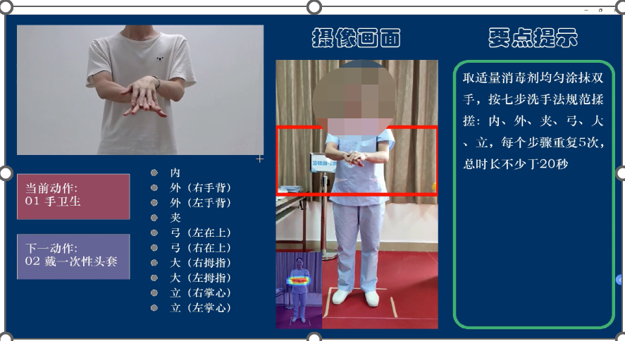
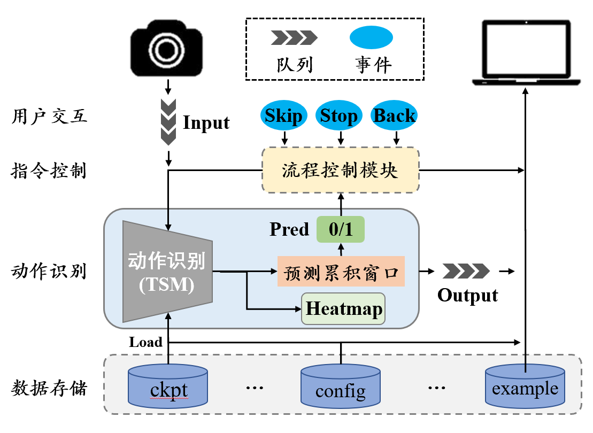

# protective-clothing-system
The action recognition system for wearing and taking off of COVID-19 protective clothing.

## The iamge of Demo.

## The design of the framework for this project.

## The command to run this program.
- Create the environment. I thinks the `venv` is good, of course, you can use `conda`.
- Install the environment required by this program.
    > pip install -r requirments.txt
- Preparing a camera, and adjust the CAMERA_ID in `setting.json5` file to adapt it, each machine is different, please try by yourself.
- Runing the main.py scripts.
    > python main.py